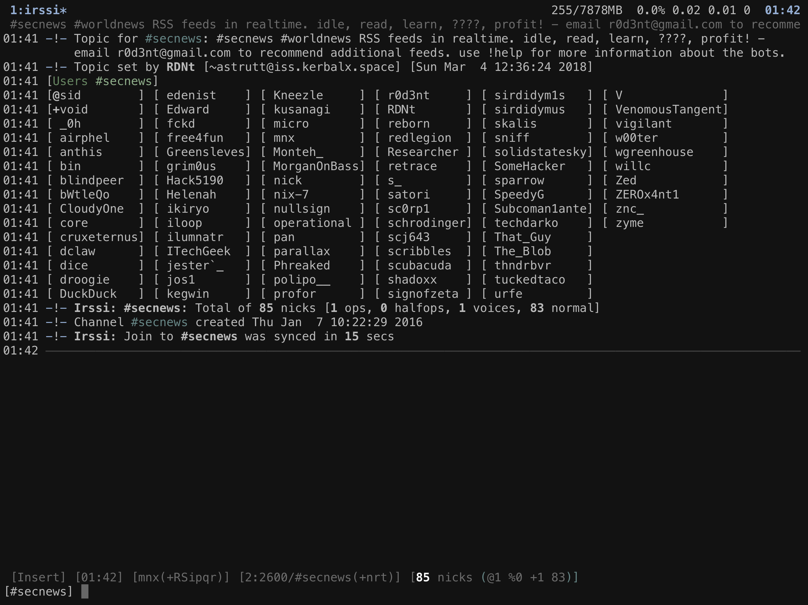

# Irssi dotfiles

My Irssi configuration with few plugins:

- **[autowhois.pl](https://scripts.irssi.org/scripts/autowhois.pl)** - /WHOIS all the users who send you a private message.
- **[dim_nicks.pl](https://scripts.irssi.org/scripts/dim_nicks.pl)** - Dims nicks that are not in channel anymore.
- **[nickcolor.pl](https://scripts.irssi.org/scripts/nickcolor.pl)** - assign a different color for each nick
- **[trackbar.pl](https://scripts.irssi.org/scripts/trackbar.pl)** - Shows a bar where you have last read a window.
- **[usercount.pl](https://scripts.irssi.org/scripts/usercount.pl)** - Adds a usercount for a channel as a statusbar item
- **[vim_mode.pl](https://github.com/shabble/irssi-scripts/tree/master/vim-mode)** - An Irssi script to emulate some of the vi(m) features for the Irssi inputline.

It comes with very color limited theme, most colors come from nicklist plugin.

